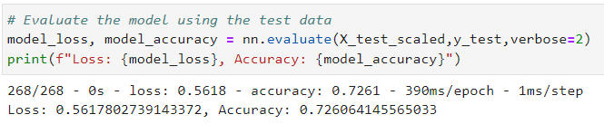
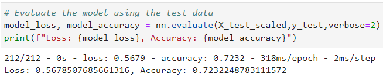
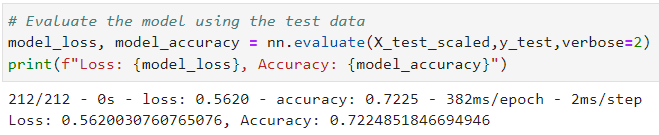
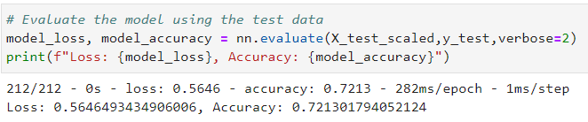

# Alphabet Soup Funding Model Evaluation 
The nonprofit foundation Alphabet Soup wants a tool that can help it select the applicants for funding with the best chance of success in their ventures.  Use the features in the provided dataset to create a binary classifier that can predict whether applicants will be successful if funded by Alphabet Soup.

## Overview of the Analysis

### Purpose
Determine if is it possible to predict the success of a venture given the following **features** of known ventures:
  * Application Type — Alphabet Soup application type ('T##')
  * Affiliation — Affiliated sector of industry ('Independent', 'CompanySponsored', 'Family/Parent', 'National', 'Regional', 'Other')
    * Most fall into Independent or CompanySponsored
  * Classification — Government organization classification ('C###')
  * Use Case — Use case for funding ('ProductDev', 'Preservation', 'Heathcare', 'CommunityServ', 'Other')
  * Organization — Organization type ('Association', 'Co-operative', 'Trust', 'Corporation')
  * Status — Active status (1, 0)
  * Income Amount — Income classification ('0', '1-9999', '10000-24999', '100000-499999', '10M-50M', '25000-99999', '50M+', '1M-5M', '5M-10M')
    * Most are listed as 0
  * Special Considerations — Special considerations for application ('Y', 'N')
  * Ask Amount — Funding amount requested (Integers)
Each known venture is categorized as successful or not in the "IS_SUCCESSFUL" column. This is the **target** for every model.

### Data Details
* There are 34,299 ventures with the features provided above to use to create and analyze a model.
* 75% of the data will be used to train the model and 25% to test it.

### Prediction Model Details
**Initial Model**

* All the features listed above are targeted in this model.
* Categorical features with more than 10 options (application type and government classification) are reduced based on population.
  * Application types with less than 500 instances are grouped into a single "other" category which totals 276 instances.
  * Classifications with less than 1,000 instances are grouped into a single "other category which totals 2,261.
* This model uses 3 layers: The first two are relu (saw little difference with other combinations in experiementing at this level)
  * relu with 4 neurons
  * relu with 4 neurons
  * sigmoid with 1 neuron
* 100 epochs will be used to train the model.
* For repeatability, I am using a random state of 1. Using other random states will provide similar results but not exact.

**Optimized Model #1**

With the initial data reduction and model inputs, the accuracy ranged between 71% and 74% depending on the exact iteration and layer configeration. This optimized model takes a look at **optimizing for accuracy only** by keeping more features in play for a single application_type and using more neurons.
* Application Type — To optimize the model accuracy potential, I chose to go with a single application type (T3) with the most data available. i.e. create a different model for each application type defined by AlphabetSoup. This reduced the data set to 27,037 instances to train and test.
* All other features are kept in full to see if complete transparency can improve accuracy for a single application type.
* This model uses 3 layers with high neuron counts to see if additional processing will improve accuracy
  * tanh with 16 neurons - changed from relu in the original because using the keras-tuner indicated tanh would be better
  * relu with 12 neurons
  * sigmoid with 1 neuron
* 100 epochs will be used to train the model.
* For repeatability, I am using a random state of 42. Using other random states will provide similar results but not exact.

**Optimized Model #2**

With the initial data reduction and model inputs, the accuracy ranged between 71% and 74% depending on the exact iteration and layer configeration. This optimized model takes a look at **optimizing for data input and accuracy** by reducing data (grouping or removing data that is less impactful) yet maintains accuracy
* Categorical features were reviewed individually for action:
  * Targeted in this model
    * Application Type — To optimize the model accuracy potential, I chose to go with a single application type (T3) with the most data available. i.e. create a different model for each application type defined by AlphabetSoup. This reduced the data set to 27,037 instances to train and test.
    * Affiliation — The top 2 categories by count made up 99.6% of the data, so the remaining categories were combined into "other"
    * Classification — The top 5 categories by count made up 97% of the data, so the remaining categories were combined into "other"
    * Organization — The top 2 categories by count made up 98% of the data, but there were only 2 more options. This was left as is.
    * Income Amount — 91% are in the top 3 buckets with the million dollar ranges making up most of the tail, so I combined all the million dollar buckets into 1.
  * Ask Amount — no changes
  * Not targeted in this model
    * Use Case — 97.9% (26469/27037) T3 rows have Use Case = Preservation. This column was dropped
    * Status — 99.98% (27032/27037) T3 rows have Status = 1. This column was dropped
    * Special Considerations — 99.9% (27010/27037) T3 rows have Special Consideration = N. This column was dropped
* This model uses 3 layers with medium-high neuron counts to see if data reduction hinders accuracy
  * tanh with 12 neurons - changed from relu in the original because using the keras-tuner indicated tanh would be better
  * relu with 8 neurons
  * sigmoid with 1 neuron
* 100 epochs will be used to train the model.
* For repeatability, I am using a random state of 42. Using other random states will provide similar results but not exact.

**Optimized Model #3**

This optimized model takes a look at **optimizing for data input, accuracy, and processing power** by maintaining accuracy and reducing layers and neurons.
* The data approach is the same as Optimized Model #2.
* This model uses 2 layers with low-medium neuron counts to see if accuracy will be maintained with less processing power
  * tanh with 4 neurons - changed from relu in the original because using the keras-tuner indicated tanh would be better
  * sigmoid with 1 neuron
* 50 epochs will be used to train the model.
* For repeatability, I am using a random state of 42. Using other random states will provide similar results but not exact.

## Results

The target performance was 75% which I was not able to achieve with any of the approaches I tried. The majority of executions resulted in an accuracy between 72% and 73% regardless of what levers (data input, layers + neurons) I pulled. Below you can see the accuracy of each model submitted. 

**Initial Model Results**

 

**Optimization Model Results**

Optimization Model #1 | Optimization Model #2 | Optimization Model #3 
:-------------------------:|:-------------------------:|:-------------------------:
High Data, High Processing | Reduced Data, High Processing | Reduced Data, Low Processing 
 |  | 

## Summary

In general, I do not recommend using any of these models to determine whether a venture is going to be successful as a 75% success rate for a high $ investment could quickly result in losing large amounts of money. For smaller investments, these types of models could make sense where the risk of failure is less impactful. 

The next level of investigation for optimization: bin the amount asked into ranges and see if models are more accurate if the potential ventures are grouped accordingly. i.e. Would a model be more accurate if the data set was limited to an asking amount rather than application type or in addition to application type?

# 
#
# Repo Notes

## File Notes
* AlphabetSoupCharity.* contains the solution as mapped out in Part 1 & Part 2 of the challenge instructions.
* funding_ventures_experiment.ipynb shows where I was experimenting to identify optimal activation function and impactful data.
* AlphabetSoupCharity_Optimization1.* contains the first level of optimization efforts to improve accuracy through brute force with maximum data for one application type.
* AlphabetSoupCharity_Optimization2.* contains the second level of optimization efforts to maintain accuracy but reduce input data to what is most important.
* AlphabetSoupCharity_Optimization3.* contains the third level of optimization efforts to maintain accuracy but reduce processing power requirements.
* The images folder contains images used in the analysis write-up

## References
* Data: IRS. Tax Exempt Organization Search Bulk Data Downloads. https://www.irs.gov/Links to an external site.
 

## Getting Started

### Prerequisites
To run the jupyter notebook with the solution, you must have Python, jupyter notebook, tensorflow, keras-tuner, scikit-learn installed in your environment

### Cloning Repo
$ git clone https://github.com/vt-bekah/deep-learning-challenge.git

$ cd deep-learning-challenge

$ jupyter lab

## Built With
* Python v3.10.11
* jupyter notebook v6.5.2
* jupyterlab v3.6.3
* conda v23.5.0
* scikit-learn v1.2.2
* tensorflow v2.14.0
* keras_tuner v1.4.5

**Python Modules**
* pandas v1.5.3
* numpy v1.24.3